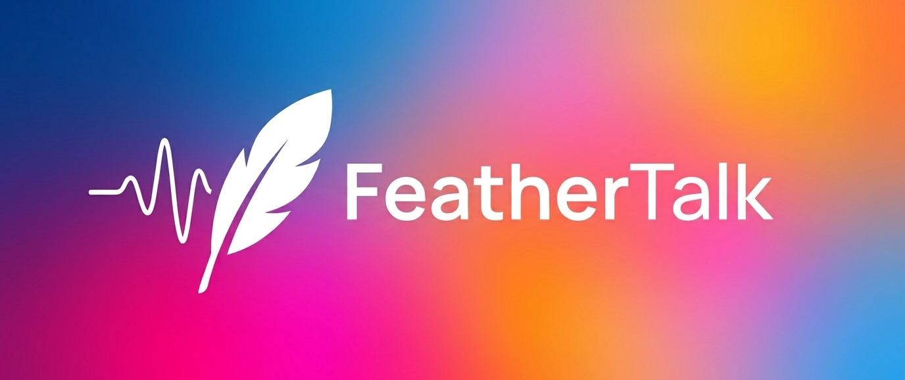

# FeatherTalk



FeatherTalk es una app local, gratis, ligera y segura de transcripción/dictado impulsada con AI. Con una sola tecla trae tus ideas con tu voz a texto limpio, bien redactado y sin errores. 

Narramos muchísimo más rapido de lo que escribimos y en esta época de AI, es cuando más lo necesitamos.

## Redes y Apoyo

Instagram: **@buildwithber**

Si este proyecto te aporta valor, de verdad me ayudaria mucho que me sigas y estes pendiente de los proximos proyectos que voy a estar compartiendo. Gracias por el apoyo! <3

Pipeline principal (siempre local):

`Grabar -> NVIDIA Parakeet ASR -> Limpieza con Llama (obligatoria) -> Pegar`

## Que Hace

- Una hotkey global inicia/detiene la grabacion.
- Muestra un widget flotante mientras graba/procesa.
- Transcribe voz con Parakeet ASR local.
- Siempre ejecuta limpieza con Llama antes de pegar.
- Pega el texto final en la app activa (Chrome, VS Code, Slack, Notion, Word, etc.).

## Modelo de Privacidad

- Procesamiento 100% local despues de la configuracion.
- No se requiere API en la nube para transcripcion ni limpieza.
- El audio y el texto se quedan en tu maquina.

## Estado Actual del MVP

Implementado:

- Maquina de estados UX (`IDLE`, `RECORDING`, `PROCESSING_ASR`, `PROCESSING_LLAMA`, `PASTING`, `DONE`, `ERROR`)
- Regla obligatoria de limpieza con Llama (no hay autopaste si falla la limpieza)
- Runtime de Electron de escritorio con bandeja + fallback de hotkey global
- Widget flotante con estados de grabacion/procesamiento/error
- Captura de audio en Windows via `ffmpeg` (WASAPI con fallback DSHOW)
- Flujo de pegado seguro para portapapeles con modo copia de respaldo
- Fallback ASR local con Windows Speech cuando el endpoint ASR no esta disponible
- Logs estructurados en consola y en `app.log`

## Scripts del Proyecto

```powershell
npm.cmd install
npm.cmd test
npm.cmd run start:all
npm.cmd run start:desktop
npm.cmd run start:asr-worker
npm.cmd run diagnose:mic
```

## Forma Recomendada de Ejecutar

Usa un solo comando para iniciar servicios locales requeridos y app de escritorio:

```powershell
npm.cmd run start:all
```

Este script:

- Resuelve y exporta la ruta de `ffmpeg`
- Inicia/valida Ollama
- Calienta el modelo Llama
- Inicia/valida el worker ASR Parakeet
- Detiene instancia Electron vieja de FeatherTalk
- Lanza la app de escritorio

## Configuracion Local

Ubicacion del archivo de settings:

`%LOCALAPPDATA%\FeatherTalk\config\settings.json`

Ubicacion de respaldo (si `%LOCALAPPDATA%` no esta disponible):

`<repo>\data\localappdata\FeatherTalk\config\settings.json`

Claves importantes:

- `hotkey` (ejemplo: `Ctrl+Shift+Space`)
- `hotkeyFallbacks`
- `microphoneDeviceId`
- `audioAllowDshowFallback`
- `ffmpegPath`
- `asrWorkerUrl` (default `http://127.0.0.1:8787/transcribe`)
- `asrAllowWindowsSpeechFallback`
- `language` (`auto`, `es`, `en`)
- `llamaBackend` (`ollama` o `llama.cpp`)
- `ollamaBaseUrl` (default `http://127.0.0.1:11434`)
- `ollamaCommand` (se recomienda ruta absoluta a `ollama.exe`)
- `llamaCppBaseUrl`
- `llamaModel` (ejemplo: `llama3.1:8b`)
- `llamaNumPredict` (si quieres evitar recortes en textos largos, usa `-1` para ilimitado)

## Ajuste de Animacion del Widget

Los parametros de animacion estan en:

`src/desktop/widgetInkRingV2Html.js`

Busca el objeto `cfg` cerca del inicio del script inline.

Parametros mas influyentes:

- `talkNoise`
- `talkThick`
- `blobLenMax`
- `blobBodyMaxWidth`
- `blobsPerSecondAtMax`

Si quieres salpicaduras de un solo lado, configura:

- `lockBlobSide: true`
- `lockedBlobAngle` hacia el lado que prefieras

## Overrides de Entorno Utiles

- `FEATHERTALK_AUDIO_MODE=stub` (grabador demo)
- `FEATHERTALK_ASR_URL`
- `FEATHERTALK_OLLAMA_URL`
- `FEATHERTALK_OLLAMA_COMMAND`
- `FEATHERTALK_LLAMA_CPP_URL`
- `FEATHERTALK_FFMPEG_PATH`

## Logs

Archivo de log:

`%LOCALAPPDATA%\FeatherTalk\logs\app.log`

Seguir logs en vivo:

```powershell
Get-Content "$env:LOCALAPPDATA\FeatherTalk\logs\app.log" -Wait
```

## Troubleshooting

### El microfono no inicia

Ejecuta:

```powershell
npm.cmd run diagnose:mic
```

Luego verifica:

- `ffmpeg` existe y es ejecutable
- Tu build soporta el modo de captura requerido (WASAPI/DSHOW)
- `microphoneDeviceId` coincide con un dispositivo real DSHOW cuando aplica

### Falla request ASR (`fetch failed`)

- Confirma que el worker ASR este corriendo en `127.0.0.1:8787`
- Verifica conectividad:

```powershell
Test-NetConnection 127.0.0.1 -Port 8787
```

### Falla limpieza con Llama

- Asegurate de que Ollama este instalado y corriendo
- Descarga el modelo:

```powershell
ollama pull llama3.1:8b
```

- Verifica puerto de Ollama:

```powershell
Test-NetConnection 127.0.0.1 -Port 11434
```

## Resumen de Arquitectura

- `src/desktop/*`: runtime de escritorio Electron (hotkey, tray, overlay)
- `src/controllers/*`: orquestacion y flujo UX
- `src/core/*`: FSM y reglas del pipeline
- `src/services/*`: ASR, limpieza, captura de audio, pegado, settings, logging
- `scripts/*`: helpers de inicio/diagnostico/worker ASR

## Regla del Producto (No Negociable)

La limpieza con Llama es obligatoria antes de pegar.
Si falla la limpieza, FeatherTalk **no** pega automaticamente la transcripcion cruda.

## Redes y Apoyo

Instagram: **@buildwithber**

Si este proyecto te aporta valor, de verdad me ayudaria mucho que me sigas y estes pendiente de los proximos proyectos que voy a estar compartiendo. Gracias por el apoyo! <3
